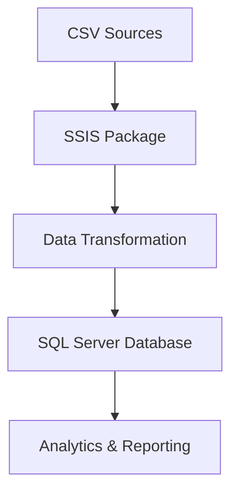

# 🏆 EndavaConcurs - Sales Data Integration Project

<div align="center">


*A comprehensive SSIS data integration solution for retail sales analytics*

---

</div>

## 📊 Project Overview

**EndavaConcurs** is a sophisticated SQL Server Integration Services (SSIS) project designed to process and integrate retail sales data from multiple CSV sources. The project implements ETL (Extract, Transform, Load) operations to consolidate sales data, product information, discounts, and geographical data into a unified data warehouse solution.

### 🎯 Purpose
This project was developed for the Endava competition/contest, demonstrating advanced data integration capabilities and business intelligence solutions for retail analytics.

## ✨ Features

- 🔄 **Multi-Source Data Integration** - Processes 9+ CSV data sources
- 📈 **Sales Analytics** - Monthly sales data processing (June-October 2020)
- 🛍️ **Product Management** - Product categories and discount information
- 🌍 **Geolocation Support** - Shop location data integration
- 🕒 **Date Dimension** - Comprehensive date details for time-based analysis
- 🔧 **SSIS Packages** - Professional ETL workflows
- 🎯 **SQL Server 2022** - Latest database technology support

## 📁 Project Structure

```
EndavaConcurs/
├── 📁 EndavaConcurs/               # Main SSIS project folder
│   ├── 📄 EndavaConcurs.dtproj     # SSIS project file
│   ├── 📄 Package.dtsx             # Main SSIS package
│   ├── 📄 EndavaConcurs.database   # Database project
│   └── 📄 Project.params           # Project parameters
├── 📄 EndavaConcurs.sln            # Visual Studio solution
├── 📄 .gitignore                   # Git ignore rules
├── 📄 .gitattributes               # Git attributes
└── 📄 README.md                    # This file
```

## 📊 Data Sources

The project integrates the following data sources:

| Data Source | Description | Format |
|-------------|-------------|---------|
| `Discount_Prods.csv` | Product discount information | CSV (CP1251) |
| `DateDetails.csv` | Date dimension data | CSV (CP1251) |
| `Geolocation_shops.csv` | Shop location coordinates | CSV (CP1251) |
| `Products Categories.csv` | Product category mappings | CSV (CP1251) |
| `Sales_06_2020_new.csv` | June 2020 sales data | CSV (CP1251) |
| `Sales_07_2020_new.csv` | July 2020 sales data | CSV (CP1251) |
| `Sales_08_2020_new.csv` | August 2020 sales data | CSV (CP1251) |
| `Sales_09_2020_new.csv` | September 2020 sales data | CSV (CP1251) |
| `Sales_10_2020_new.csv` | October 2020 sales data | CSV (CP1251) |

## 🚀 Getting Started

### Prerequisites

Before running this project, ensure you have:

- **SQL Server 2022** (or compatible version)
- **SQL Server Data Tools (SSDT)** for Visual Studio
- **Visual Studio 2019/2022** with SSIS extension
- **SQL Server Integration Services** runtime

### Installation

1. **Clone the repository**
   ```bash
   git clone https://github.com/Kwameldx666/EndavaConcurs.git
   cd EndavaConcurs
   ```

2. **Open the solution**
   ```bash
   # Open in Visual Studio
   start EndavaConcurs.sln
   ```

3. **Configure connections**
   - Update connection strings in the SSIS package
   - Ensure SQL Server instance is running
   - Verify tempdb access permissions

4. **Prepare data files**
   - Ensure all CSV files are available in the expected directory
   - Verify file encoding (CP1251/Cyrillic)
   - Check file permissions

### Configuration

#### Connection Managers

The project uses the following connection managers:

- **LocalHost.tempdb** - Main database connection
- **Flat File Connections** - CSV file connections for each data source

#### Parameters

Key project parameters include:
- File paths for CSV sources
- Database connection settings
- Encoding and delimiter configurations

## 🔧 Usage

### Running the ETL Process

1. **Open the SSIS project** in Visual Studio
2. **Configure connection managers** with your environment settings
3. **Update file paths** to match your CSV file locations
4. **Execute the package** using one of these methods:
   - Press F5 in Visual Studio
   - Right-click Package.dtsx → Execute Package
   - Deploy to SSIS Catalog and run via SQL Server

### Data Flow



## 📈 Business Intelligence

This project enables various analytics scenarios:

- **Sales Performance Analysis** - Monthly sales trends
- **Product Analytics** - Category performance and discount impact
- **Geographical Analysis** - Shop location insights
- **Time-based Reporting** - Date dimension analytics

## 🛠️ Technical Details

### Technology Stack

- **Platform**: Microsoft SQL Server Integration Services (SSIS)
- **Database**: SQL Server 2022
- **Development**: Visual Studio with SSDT
- **Data Format**: CSV files with Cyrillic encoding (CP1251)
- **Locale**: Russian (1049)

### Performance Considerations

- Optimized for batch processing
- Supports incremental data loads
- Includes error handling and logging
- Configurable for different environments

## 📝 Development

### Project Metadata

- **Created**: May 24, 2025
- **Creator**: Kwameldx666
- **Version**: 1.0.0
- **Target Framework**: SQL Server 2022
- **Format Version**: 8

### Contributing

1. Fork the repository
2. Create a feature branch
3. Make your changes
4. Test thoroughly
5. Submit a pull request

## 🐛 Troubleshooting

### Common Issues

**Connection Problems**
- Verify SQL Server is running
- Check connection strings
- Ensure proper permissions

**File Access Issues**
- Verify CSV file paths
- Check file permissions
- Ensure proper encoding

**Package Execution Errors**
- Review SSIS logs
- Check data quality
- Validate transformations

## 📄 License

This project is licensed under the MIT License - see the [LICENSE](LICENSE) file for details.

## 🤝 Acknowledgments

- **Endava** - For hosting the competition
- **Microsoft** - For SSIS technology
- **Contributors** - For project development

## 📞 Contact

For questions or support, please contact:
- **GitHub**: [@Kwameldx666](https://github.com/Kwameldx666)
- **Project**: [EndavaConcurs](https://github.com/Kwameldx666/EndavaConcurs)

---

<div align="center">

**Made with ❤️ for the Endava Competition**

[](https://github.com/Kwameldx666/EndavaConcurs/stargazers)
[](https://github.com/Kwameldx666/EndavaConcurs/network/members)
[](https://github.com/Kwameldx666/EndavaConcurs/issues)

</div>