# 🏆 EndavaConcurs - Sales Data Integration Project

<div align="center">


*A comprehensive SSIS data integration solution for retail sales analytics*

---

</div>

## 📊 Project Overview

**EndavaConcurs** is a sophisticated SQL Server Integration Services (SSIS) project designed to process and integrate retail sales data from multiple CSV sources. The project implements ETL (Extract, Transform, Load) operations to consolidate sales data, product information, discounts, and geographical data into a unified data warehouse solution.

### 🎯 Purpose
This project was developed for the Endava competition/contest, demonstrating advanced data integration capabilities and business intelligence solutions for retail analytics.

## ✨ Features

- 🔄 **Multi-Source Data Integration** - Processes 9+ CSV data sources
- 📈 **Sales Analytics** - Monthly sales data processing (June-October 2020)
- 🛍️ **Product Management** - Product categories and discount information
- 🌍 **Geolocation Support** - Shop location data integration
- 🕒 **Date Dimension** - Comprehensive date details for time-based analysis
- 🔧 **SSIS Packages** - Professional ETL workflows
- 🎯 **SQL Server 2022** - Latest database technology support

## 📁 Project Structure

```
EndavaConcurs/
├── 📁 EndavaConcurs/               # Main SSIS project folder
│   ├── 📄 EndavaConcurs.dtproj     # SSIS project file
│   ├── 📄 Package.dtsx             # Main SSIS package
│   ├── 📄 EndavaConcurs.database   # Database project
│   └── 📄 Project.params           # Project parameters
├── 📄 EndavaConcurs.sln            # Visual Studio solution
├── 📄 .gitignore                   # Git ignore rules
├── 📄 .gitattributes               # Git attributes
└── 📄 README.md                    # This file
```

## 📊 Data Sources

The project integrates the following data sources:

| Data Source | Description | Format |
|-------------|-------------|---------|
| `Discount_Prods.csv` | Product discount information | CSV (CP1251) |
| `DateDetails.csv` | Date dimension data | CSV (CP1251) |
| `Geolocation_shops.csv` | Shop location coordinates | CSV (CP1251) |
| `Products Categories.csv` | Product category mappings | CSV (CP1251) |
| `Sales_06_2020_new.csv` | June 2020 sales data | CSV (CP1251) |
| `Sales_07_2020_new.csv` | July 2020 sales data | CSV (CP1251) |
| `Sales_08_2020_new.csv` | August 2020 sales data | CSV (CP1251) |
| `Sales_09_2020_new.csv` | September 2020 sales data | CSV (CP1251) |
| `Sales_10_2020_new.csv` | October 2020 sales data | CSV (CP1251) |

## 🚀 Getting Started

### Prerequisites

Before running this project, ensure you have:

- **SQL Server 2022** (or compatible version)
- **SQL Server Data Tools (SSDT)** for Visual Studio
- **Visual Studio 2019/2022** with SSIS extension
- **SQL Server Integration Services** runtime

### Installation

1. **Clone the repository**
   ```bash
   git clone https://github.com/Kwameldx666/EndavaConcurs.git
   cd EndavaConcurs
   ```

2. **Open the solution**
   ```bash
   # Open in Visual Studio
   start EndavaConcurs.sln
   ```

3. **Configure connections**
   - Update connection strings in the SSIS package
   - Ensure SQL Server instance is running
   - Verify tempdb access permissions

4. **Prepare data files**
   - Ensure all CSV files are available in the expected directory
   - Verify file encoding (CP1251/Cyrillic)
   - Check file permissions

### Configuration

#### Connection Managers

The project uses the following connection managers:

- **LocalHost.tempdb** - Main database connection
- **Flat File Connections** - CSV file connections for each data source

#### Parameters

Key project parameters include:
- File paths for CSV sources
- Database connection settings
- Encoding and delimiter configurations

## 🔧 Usage

### Running the ETL Process

1. **Open the SSIS project** in Visual Studio
2. **Configure connection managers** with your environment settings
3. **Update file paths** to match your CSV file locations
4. **Execute the package** using one of these methods:
   - Press F5 in Visual Studio
   - Right-click Package.dtsx → Execute Package
   - Deploy to SSIS Catalog and run via SQL Server

### Data Flow

```mermaid
graph TD
    A[📄 CSV Sources] --> B[🔄 SSIS Package]
    B --> C[⚙️ Data Transformation]
    C --> D[🗄️ SQL Server Database]
    D --> E[📊 Analytics & Reporting]
    
    A1[Discount_Prods.csv] --> B
    A2[Sales_06-10_2020.csv] --> B
    A3[Products_Categories.csv] --> B
    A4[Geolocation_shops.csv] --> B
    A5[DateDetails.csv] --> B
```



## 🏗️ Architecture

### Data Architecture Overview

```mermaid
graph LR
    subgraph "📁 Data Sources"
        CSV1[Sales Data 📊]
        CSV2[Product Data 🛍️]
        CSV3[Location Data 🌍]
        CSV4[Discount Data 💰]
        CSV5[Date Data 📅]
    end
    
    subgraph "🔄 ETL Layer"
        SSIS[SSIS Package]
        CM[Connection Managers]
        DT[Data Transformations]
    end
    
    subgraph "🗄️ Storage Layer"
        DB[(SQL Server 2022)]
        TDB[(tempdb)]
    end
    
    subgraph "📊 Analytics Layer"
        BI[Business Intelligence]
        REP[Reports]
        DASH[Dashboards]
    end
    
    CSV1 --> SSIS
    CSV2 --> SSIS
    CSV3 --> SSIS
    CSV4 --> SSIS
    CSV5 --> SSIS
    
    SSIS --> CM
    CM --> DT
    DT --> DB
    DB --> TDB
    
    DB --> BI
    BI --> REP
    BI --> DASH
```



## 📊 Business Intelligence

This project enables various analytics scenarios:

- **Sales Performance Analysis** - Monthly sales trends
- **Product Analytics** - Category performance and discount impact
- **Geographical Analysis** - Shop location insights
- **Time-based Reporting** - Date dimension analytics

### Sample Analytics Queries

```sql
-- Monthly Sales Performance
SELECT 
    YEAR(sales_date) as Year,
    MONTH(sales_date) as Month,
    SUM(sales_amount) as Total_Sales,
    COUNT(DISTINCT product_id) as Products_Sold
FROM sales_data 
GROUP BY YEAR(sales_date), MONTH(sales_date)
ORDER BY Year, Month;

-- Top Performing Product Categories
SELECT 
    pc.category_name,
    SUM(s.sales_amount) as Total_Revenue,
    AVG(d.discount_percentage) as Avg_Discount
FROM sales_data s
JOIN product_categories pc ON s.product_id = pc.product_id
LEFT JOIN discounts d ON s.discount_id = d.discount_id
GROUP BY pc.category_name
ORDER BY Total_Revenue DESC;

-- Geographical Sales Distribution
SELECT 
    gs.shop_location,
    gs.latitude,
    gs.longitude,
    SUM(s.sales_amount) as Location_Revenue
FROM sales_data s
JOIN geolocation_shops gs ON s.shop_id = gs.shop_id
GROUP BY gs.shop_location, gs.latitude, gs.longitude
ORDER BY Location_Revenue DESC;
```

## 🛠️ Technical Details

### Technology Stack

- **Platform**: Microsoft SQL Server Integration Services (SSIS)
- **Database**: SQL Server 2022
- **Development**: Visual Studio with SSDT
- **Data Format**: CSV files with Cyrillic encoding (CP1251)
- **Locale**: Russian (1049)

### Performance Considerations

- ✅ Optimized for batch processing
- ✅ Supports incremental data loads
- ✅ Includes comprehensive error handling
- ✅ Configurable for different environments
- ✅ Memory-efficient data transformations
- ✅ Parallel execution capabilities

### Monitoring & Logging

The project includes built-in monitoring features:

- **📊 SSIS Execution Reports** - Detailed package execution statistics
- **🔍 Error Logging** - Comprehensive error capture and reporting
- **⏱️ Performance Metrics** - Execution time and throughput monitoring
- **📈 Data Quality Checks** - Validation and data integrity reporting

## 📝 Development

### Project Metadata

- **Created**: May 24, 2025
- **Creator**: Kwameldx666
- **Version**: 1.0.0
- **Target Framework**: SQL Server 2022
- **Format Version**: 8

### Contributing

We welcome contributions! Please follow these steps:

1. 🍴 **Fork the repository**
2. 🌿 **Create a feature branch**
   ```bash
   git checkout -b feature/amazing-feature
   ```
3. ✨ **Make your changes**
4. 🧪 **Test thoroughly** 
   - Test SSIS package execution
   - Validate data transformations
   - Check error handling
5. 📝 **Commit your changes**
   ```bash
   git commit -m 'Add amazing feature'
   ```
6. 🚀 **Push to the branch**
   ```bash
   git push origin feature/amazing-feature
   ```
7. 🔄 **Open a Pull Request**

### Code Style Guidelines

- Follow Microsoft SSIS best practices
- Use descriptive naming conventions
- Include proper error handling
- Document complex transformations
- Test with sample data

## 🐛 Troubleshooting

### Common Issues

**🔌 Connection Problems**
- ✅ Verify SQL Server is running
- ✅ Check connection strings in SSIS package
- ✅ Ensure proper authentication permissions
- ✅ Test database connectivity

**📁 File Access Issues**
- ✅ Verify CSV file paths are correct
- ✅ Check file read permissions
- ✅ Ensure proper encoding (CP1251)
- ✅ Validate file formats and delimiters

**⚙️ Package Execution Errors**
- ✅ Review SSIS execution logs
- ✅ Check data quality and consistency
- ✅ Validate transformation logic
- ✅ Verify target table schemas

**🌐 Character Encoding Issues**
- ✅ Ensure CSV files are encoded in CP1251 (Cyrillic)
- ✅ Check SSIS code page settings
- ✅ Validate locale settings (Russian - 1049)

## ❓ FAQ

<details>
<summary><strong>How do I change the target database?</strong></summary>

Update the connection manager settings in the SSIS package:
1. Open Package.dtsx in Visual Studio
2. Right-click the connection manager
3. Select "Edit Connection Manager"
4. Update server name and database settings
</details>

<details>
<summary><strong>Can I add more data sources?</strong></summary>

Yes! To add new CSV sources:
1. Add a new Flat File Connection Manager
2. Configure the file format and columns
3. Add corresponding data flow components
4. Map to target tables
</details>

<details>
<summary><strong>How do I schedule automatic execution?</strong></summary>

Deploy the package to SSIS Catalog and use SQL Server Agent:
1. Deploy project to SSIS Catalog
2. Create SQL Server Agent Job
3. Add SSIS Package Execution step
4. Configure schedule and notifications
</details>

<details>
<summary><strong>What about data validation?</strong></summary>

The package includes:
- Data type validation
- Null value handling
- Error row redirection
- Execution logging
</details>

## 📄 License

This project is licensed under the MIT License - see the [LICENSE](LICENSE) file for details.

## 🤝 Acknowledgments

- **Endava** - For hosting the competition
- **Microsoft** - For SSIS technology
- **Contributors** - For project development

## 📞 Contact

For questions or support, please contact:
- **GitHub**: [@Kwameldx666](https://github.com/Kwameldx666)
- **Project**: [EndavaConcurs](https://github.com/Kwameldx666/EndavaConcurs)

---

<div align="center">

**Made with ❤️ for the Endava Competition**

[](https://github.com/Kwameldx666/EndavaConcurs/stargazers)
[](https://github.com/Kwameldx666/EndavaConcurs/network/members)
[](https://github.com/Kwameldx666/EndavaConcurs/issues)

</div>